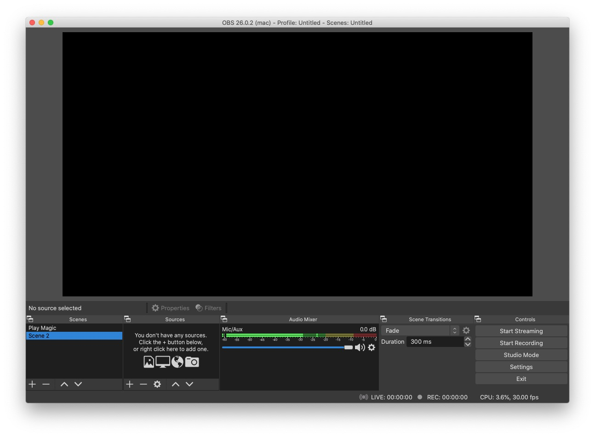
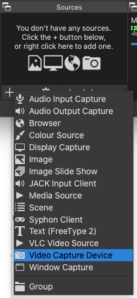
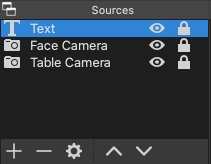
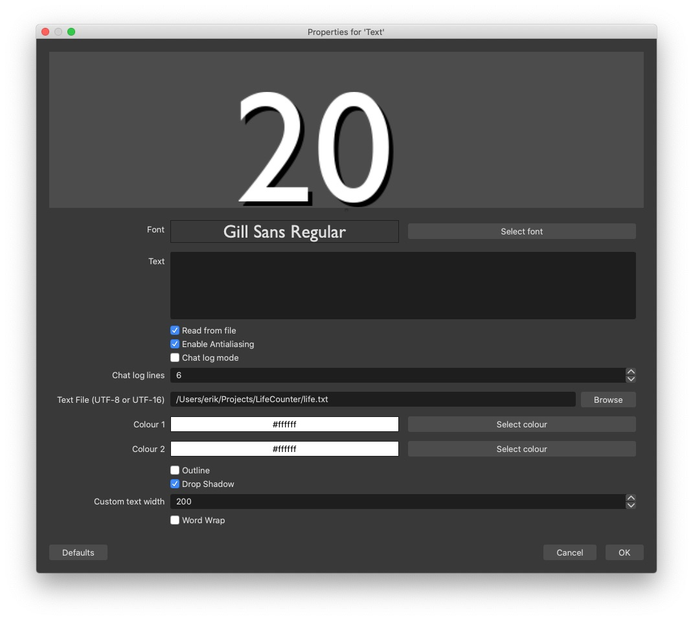

## Fancy Cam Setup

*Playing Magic the Gathering online using a webcam has really become popular in the last year or so. I was reluctant at first, but quickly realized that it is great fun and works much better than expected. Still, I think there's some room for improvement to the bare-bones setup that most people use. More specifically, since we are trying to recreate a social situation I think it helps to see the face of the other player! Perhaps this is not for everyone, but in my opinion it gives you a much better feeling of actually playing together.*

This short guide will show you how to set this up for yourself. As an added bonus we will add a life counter overlay, to make sure that you and your opponent agree on your current life total (this sometimes becomes an issue when playing online, due to low camera resolution and laggy communication.)

Here's how the final setup will look:


### Cameras

This setup requires **two** web cameras. Often your computer will have a built-in one, and your phone can act as an extra one using [Epoc Cam]() or similar apps. I personally use the front-facing camera of my desktop computer (an iMac), together with a [Logitech Streamcam](https://www.logitech.com/en-us/products/webcams/streamcam.960-001289.html).


### Software

1. [OBS](https://obsproject.com/)
2. OBS virtual cam plugin [Windows](https://obsproject.com/forum/resources/obs-virtualcam.949/) / [MacOS](https://github.com/johnboiles/obs-mac-virtualcam)
3. A text editor

First install OBS, and then the plugin. The text editor should come with your operating system (*Notepad* on Windows or *TextEdit* on macOS works well enough.)


### OBS Configuration

#### 1. Start OBS

If you haven't used the program before, it will look something like this:



#### 2. Adding camera sources

By pressing the "+" in the "Sources" section you can add different inputs:



Add two "Video Capture Device" sources and select your two different web cameras as inputs for them. You can drag them around in the top window to lay them out as you wish. Double click the name of an input to bring up its settings. I like to lock the input source (using the little padlock icon) when things look good, to not accidentally mess it up later.

#### 3. The life counter

The life counter will be controlled by a file on your computer. Using a text editor, save a file called something like `life.txt` in a convenient location on your hard drive -- just remember where you put it! It should contain the contents "20" on its first line, like this:

```text
20
```

Now add a third source in OBS, but this time choose "Text":



Double click the text to edit its settings. The most important thing is to enable "Read from file" and set the "Text File" to the `life.txt` file you just created. Also choose a nice font, and maybe add some drop shadow to make the text stand out from the background better.




### Virtualization

To make use of the final OBS video when playing, you need to make it appear as a webcam for whatever chat program that you use (Whereby, Zoom, etc). This is done (after installing the plugin) in the OBS menu bar, go to `Tools > Start Virtual Camera`.

You should now be able to select this camera as any other physical web camera (your "raw" inputs will still be available too, of course.)


### Changing your life total

When you take damage or gain life, just edit the text file! If you want keyboard shortcuts for this instead, I've made a [small C program](lifecounter.c) (only tested on macOS). But editing the file might actually require less key presses and be more convenient.


### Final Thoughts

I hope this guide was useful to some of you! If you don't want to have this kind of complicated setup I totally understand that, but I think it's at least worth trying out. Hope to play with you soon!
