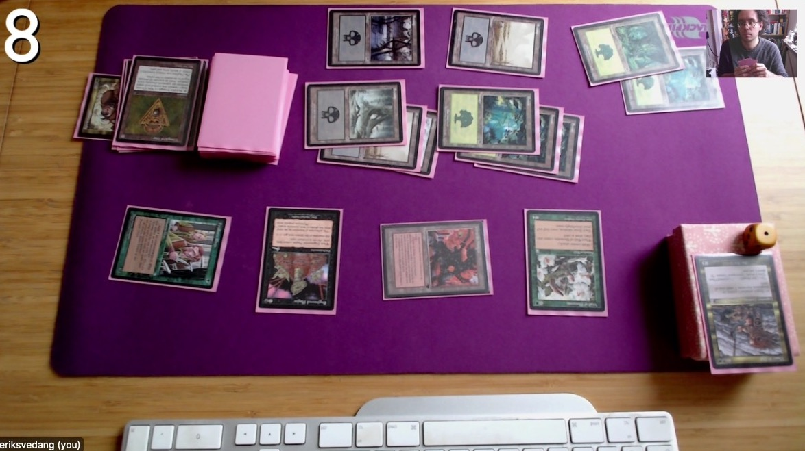

## Fancy Cam Setup

Playing Magic the Gathering online using a webcam has really become popular in the last year or so. I was reluctant at first, but quickly realized that it is great fun and works much better than it should. Still, I think there's some room for improvement to the bare-bones setup that most people use. Specifically -- since we're trying to recreate a *social* situation -- I think it makes sense to see the face of the other player. Perhaps this is not for everyone, but in my opinion it gives you a much better feeling of playing together. This short guide will show you how to set this up for your self. As an added bonus we will add in a life counter overlay, to make sure that you and your opponent agree on its current value (this sometimes becomes an issue when playing online, due to low camera resolution and laggy communication.) Here's how the final setup will look:

